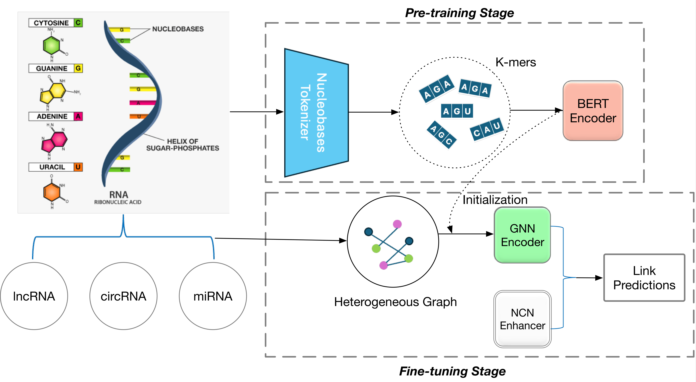

## Integrating BERT Pre-training with Graph Common Neighbours for Predicting ceRNA Interactions

This repository contains the PyTorch implementation for our BCGP. Our paper is currently under review. Please stay tuned for more news. 

## Abstract

Predicting interactions between microRNAs and competing endogenous RNAs (ceRNAs), including long non-coding RNAs (lncRNAs) and circular RNAs (circRNAs), is critical for understanding gene regulation. With the development of graph neural networks, existing works have demonstrated the ability to capture information from interactions between microRNA and ceRNAs to predict unseen interactions. However, due to deep GNNs, which only leverage node-node pairwise features, existing methods neglect the information in their chains since different RNAs have chains of different lengths.
To address this issue, we propose a novel model termed the BERT-based ceRNA Graph Predictor (BCGP), which leverages both RNA sequence information and the heterogeneous relationships between lncRNAs, circRNAs, and miRNAs. Our BCGP method employs a transformer-based model to generate contextualized representations that consider the global context of the entire RNA sequence. Subsequently, we enrich the RNA interaction graph using these contextualized representations generated by BERT. Furthermore, to improve the performance of association prediction, BCGP utilizes the Neural Common Neighbour (NCN) technique to capture more refined node features, leading to more informative and flexible representations.
Through comprehensive experiments on two real-world datasets of lncRNA-miRNA and circRNA-miRNA associations, we demonstrate that BCGP outperforms competitive baselines across various evaluation metrics and achieves more accurate association predictions. In our case studies on two types of miRNAs, we demonstrate BCGP’s remarkable performance in predicting both miRNA-lncRNA and miRNA-circRNA associations.

## Model Framework Overview

<p align="center">
  
</p>

## Installation

```shell
pip install -r requirements.txt
```

## BCGP Training & Inference 

```bash
python main_ncn.py 
```
